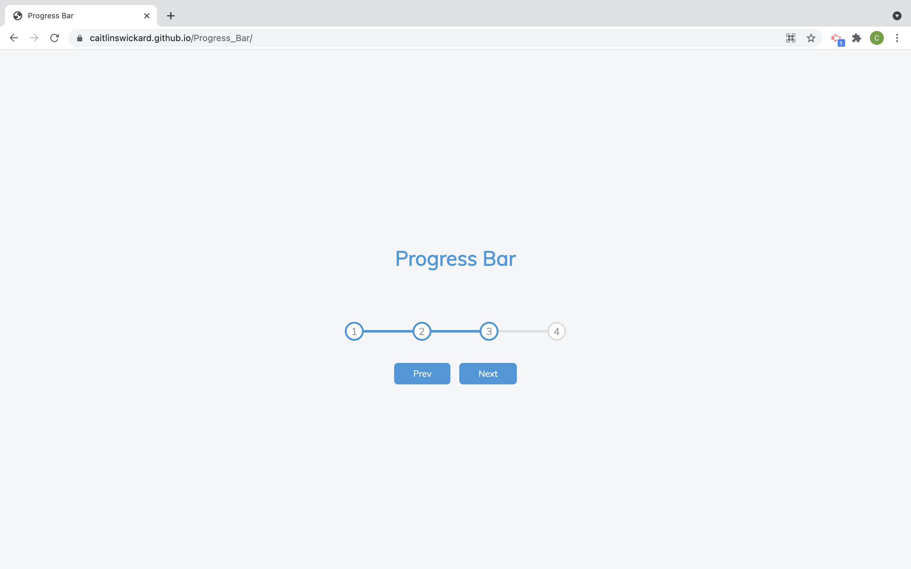

# Progress Bar

For this project I built a progress bar. This bar completes both circle color change as well as a line fill in as the steps are completed. Click the Next button to complete steps, click the Prev button to move back a step. This sort of progress bar can be used on other projects like steps to complete for a shopping cart for E-commerce or progress in filling out a form. 

[View deployed page here](https://caitlinswickard.github.io/Progress_Bar/)
- [Installation](#install)
- [Usage](#usage)

## Install

Clone project:
- https://docs.github.com/en/repositories/creating-and-managing-repositories/cloning-a-repository

## Usage
Open page in live web browser and click on Next button to watch the progress bar complete. Click the Prev button to watch the progress go back. 

## Built With

- HTML
- CSS
- JavaScript

## View

#### Credits
50 projects in 50 days HTML, CSS & JavaScript Udemy course